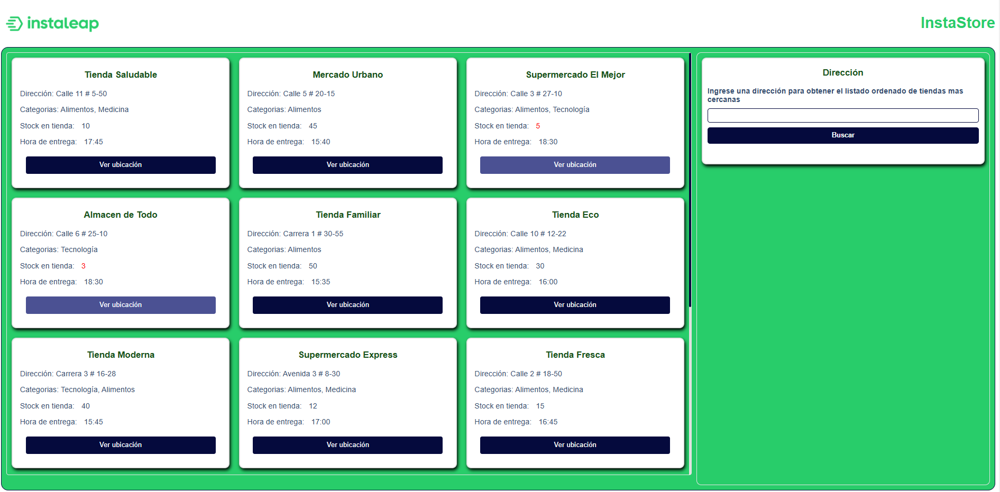
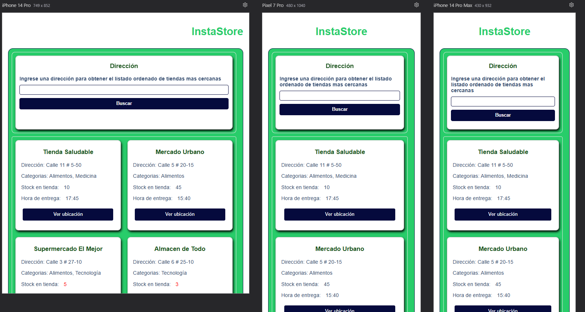

# InstaStore Challenge

##### El objetivo de esta aplicacion es poder visualizar una interfaz que proporcione información de las tiendas más cercanas disponibles para poder recibir un pedido a un cliente.

#

## Caracteristicas

##### InstaStore es una aplicación desarrollada con React js la cual muestra un listado de tiendas con su nombre, dirección, categorias de productos, stock en tienda y hora de entrega. tambien, cuenta con un botón para ver la ubicación de la tienda y que el usuario pueda saber a cuanto esta de distancia de donde el esté, tiene un campo de texto en donde el usuario puede ingresar una dirección y en base a ella, la aplicación ordena las tiendas de la mas cercana a la mas lejana para saber cual es la mas idonea para realizar la recogida del pedido.

#

## Screenshots




## Tecnologias usadas

- ReactJS
- Material UI
- Google Maps API
- OpenStreetMap API
- Github
- Yarn
- TypeScript

## Instalación

Verificar que se tenga Nodejs instalado o en una version superior a la 16 (v22.4.1) para la ejecucion de los comandos, tambien veriricar que se tenga yarn instalado

```
- node -v ===> verificar version de node
- yarn -v ===> verificar yarn en el pc
```

Una vez descargado el repositorio, se puede ver el proyecto con un editor como VS Code o sublime, tambien, se puede abrir directamente desde una terminal para ejecutar los comandos

```sh
- cd store-availability
- yarn
- npm run dev
```

De esa forma, en la terminal, generara una url parecida a esta http://localhost:5173/ en donde se puede ver la app en un entorno local y de desarrollo

## Endpoints

#

#

| API           | Documentación                                                      |
| ------------- | ------------------------------------------------------------------ |
| OpenStreetMap | [https://nominatim.org/release-docs/develop/api/Overview/][PlDb]   |
| Google Maps   | [https://developers.google.com/maps/documentation?hl=es-419][PlGh] |
